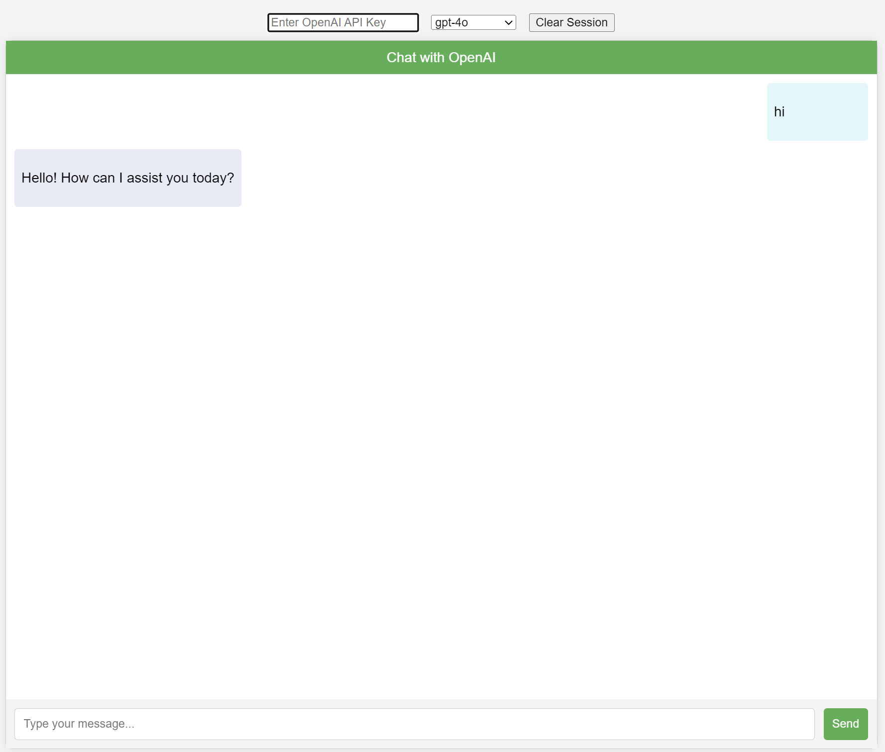

# ChatGPT App Using OpenAI Key
Simple HTML to convert your GPT Key as a ChatGPT UI.



The application can be used as a simple ChatGPT who does not have a ChatGPT subscription but OpenAI key.

## Features

- [x] Basic Chat
- [x] Input box for entering OpenAI API key
- [x] Options to select the OpenAI model
- [x] Session management & Clear session functionality
- [x] Chat with simple enter-press
- [x] Code snippets with copy button
- [ ] Image Support
- [ ] Voice Support

## Getting Started

### Prerequisites

- Node.js and npm installed
- An OpenAI API key


## Installation

- Clone the repository
  ```sh
  git clone https://github.com/your-repo/chat-interface.git
  cd chat-interface
- Install http-server globally using node
  ```bash
  npm install http-server -g
- Run the server using the cmd/terminal
  ```bash
  http-server

## Usage

- Navigate to hosted port in localhost
- eg :- localhost:8080
- Enter the OpenAI key in input box

## Enjoy
